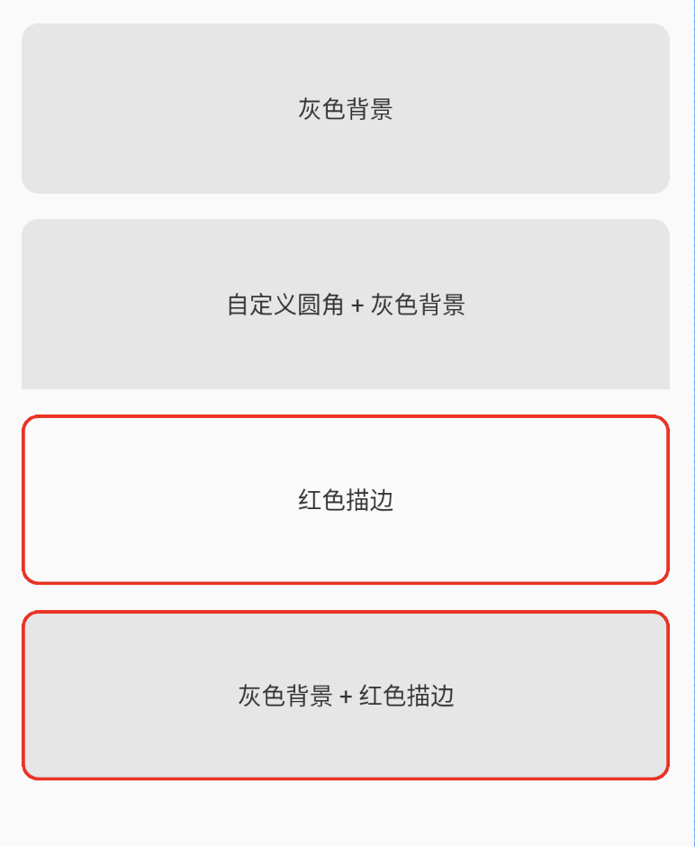

## RoundLayout
可以任意定义4个角的角度，还有描边功能。

### 效果图


### 使用

1. 引入第三方库
```gradle
implementation 'me.codego.view:round-layout:1.0@aar'
```

2. 插入控件
```xml
<me.codego.view.RoundLayout
        android:id="@+id/first_layout"
        android:layout_width="match_parent"
        android:layout_height="100dp"
        android:layout_marginStart="15dp"
        android:layout_marginTop="15dp"
        android:layout_marginEnd="15dp"
        android:background="#E6E6E6"
        app:layout_constraintLeft_toLeftOf="parent"
        app:layout_constraintRight_toRightOf="parent"
        app:layout_constraintTop_toTopOf="parent"
        app:round_radius="10dp">

</me.codego.view.RoundLayout>
```